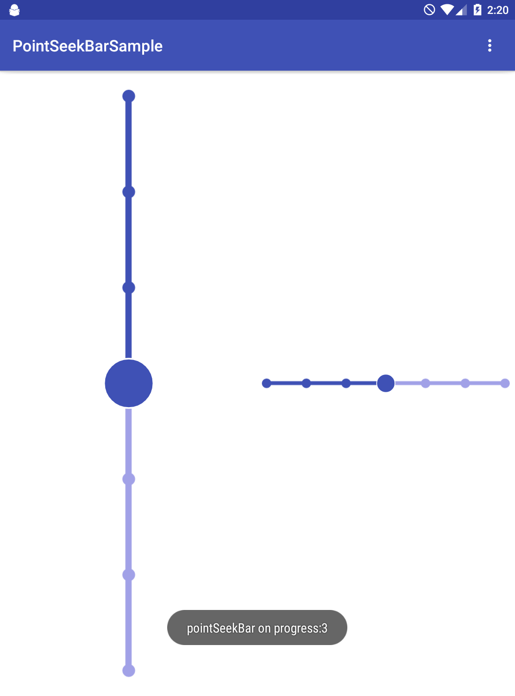

# PointSeekBar
SeekBar tumb with Circle
which supports Horizontal and Vertical.

<attr name="android:orientation" />
<attr name="point_progress" format="integer" />
<attr name="point_max" format="integer" />
<attr name="point_small_radius" format="dimension" />
<attr name="point_block_radius" format="dimension" />
<attr name="point_progress_height" format="dimension" />
<attr name="point_progress_full_color" format="color" />
<attr name="point_progress_empty_color" format="color" />
<attr name="point_border_line_color" format="color" />
<attr name="point_border_fill_color" format="color" />
<attr name="point_border_line_width" format="dimension" />

